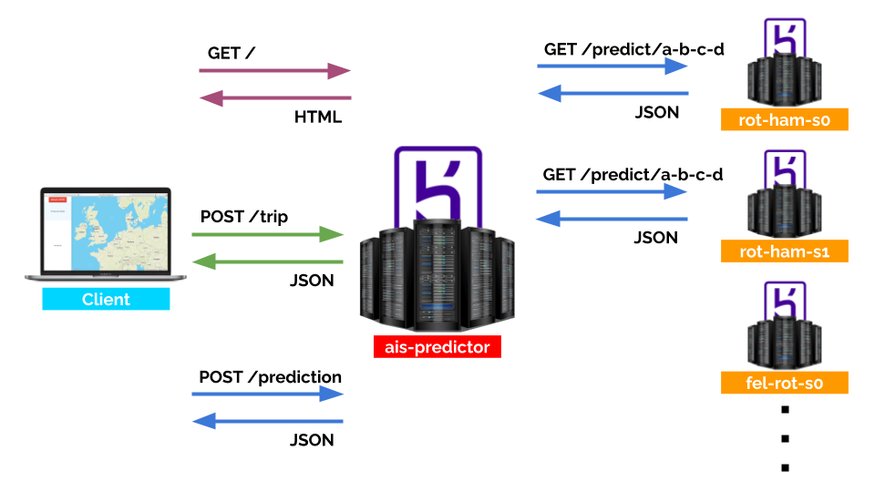

# AIS-Predictor

Did you ever want to know when and where your ship arrives? Worry no more ... 😎

## About

This is our project of a distributed machine learning application to predict the routes and ETAs of ships based on their AIS data, built as the summer term assignment for the *Software Development* module at *Hamburg University of Technology*.

The application we develeped uses a *broker-agent* architecture. The *broker* is the centerpiece of this architecture. It servers a web interface where the user can upload the input data to run predictions on (as a `.arff` file) and then see a visual representation of the predicted route on a map. In order to predict an accurate route for the given AIS data sample of a ship, the broker sends out requests to multiple *agents* - other servers, each an "expert" for its own sector of a ny of the two routes considered in this project. The sectors are shown in the map below.

For each agent, we selected the corresponding data, clean and preprocessed it, and then trained three seperate models on the data - a Random Forrest, an Artificial Neural Network, and A K-Nearest-Neighbour regressor. The agent returns to the agent the output of the model that performed best on the evaluation on the test data. Once all agents have returned their predictions, the broker shows the predicted route in the web interface. See below for a diagram of this communication scheme.

All implementations are written in *Python*. Data preprocessing and training of the models was done using the *Scikit-learn* and *Pandas* packages inside of *Jupyter* notebooks. The final product is running *Flask* web servers inside of *Docker* containers. For an overview of the complete tech stack, see the image below.

## Run it yourself

The easiest way to try is to use the version we hosted ourselves on *Heroku*. Just visit [ais-predictor.herokuapp.com], upload a correctly sructured `.arff` file of AIS data and predict away. The servers might take a moment to wake up because Heroku puts them into sleep mode after sitting idle for 30 minutes. Note that, unfortunately, we cannot provie our original `.arff` files for copyright reasons.

Alternatively, you may run the Docker images for the broker and all agents yourself. Keep in mind that you will probably need to change the agent URLs given to the broker.
